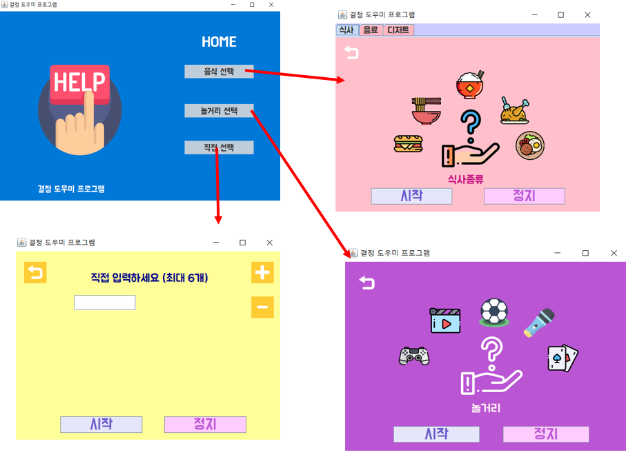
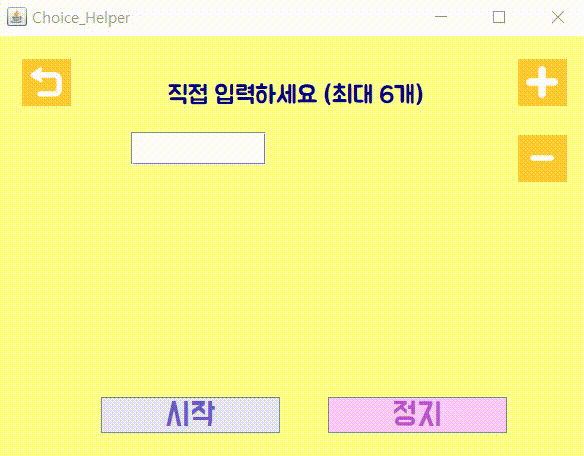

# OpenSource_Team_E
    조선대학교 오픈소스SW개론 수업에서 수행하는 팀프로젝트입니다.

# Overview

# Introduction
* 개발프로그램 : 결정 도우미 프로그램
* 개발환경 : Java Swing + Github
* 내용 : 일상생활에서 생기는 결정의 어려움을 도와주는 프로그램입니다.

# Design
* 설계

* 최종 디자인

# Release Notes
### 2018/11/11 #1
Updates
* README.md 파일 최초 작성
* Overview 사진등록, Introduction 작성

### 2018/11/12 #2
Updates
* 프로젝트에 사용할 기본 Java Project 틀 Push

### 2018/11/17 #3
Updates
* 11.12에 업데이트한 틀에 홈화면 UI추가

### 2018/11/21 #4
Updates
* 팀원 3명이 각각 구현한 food_choice + home_main + play_choice 화면을 버튼을 누르면 각각 화면으로 이동

### 2018/11/26 #5
Updates
* 놀거리선택 화면 난수를 생성해서 랜덤음식이 보이게 설정
* 음식, 놀거리 이미지 업데이트

### 2018/11/28 #6
Updates
* 사용자 선택 화면 기능 구현 및 UI 만들기
* 전체 기능 점검

