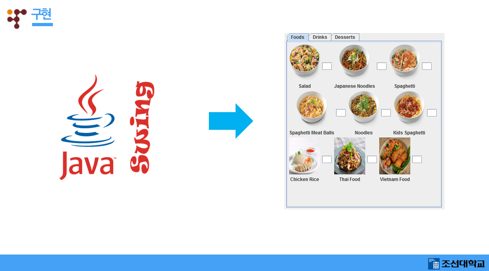

# OpenSource_Team_E
    조선대학교 오픈소스SW개론 수업에서 수행하는 팀프로젝트입니다.

# Overview

# Introduction
* 개발프로그램 : 결정 도우미 프로그램
* 개발환경 : Java Swing + Github
* 내용 : 일상생활에서 생기는 결정의 어려움을 도와주는 프로그램입니다.

# Release Notes
### 2018/11/11 #1
Updates
* README.md 파일 최초 작성
* Overview 사진등록, Introduction 작성

### 2018/11/12 #2
Updates
* 프로젝트에 사용할 기본 Java Project 틀 Push

### 2018/11/17 #3
Updates
* 11.12에 업데이트한 틀에 홈화면 UI추가

